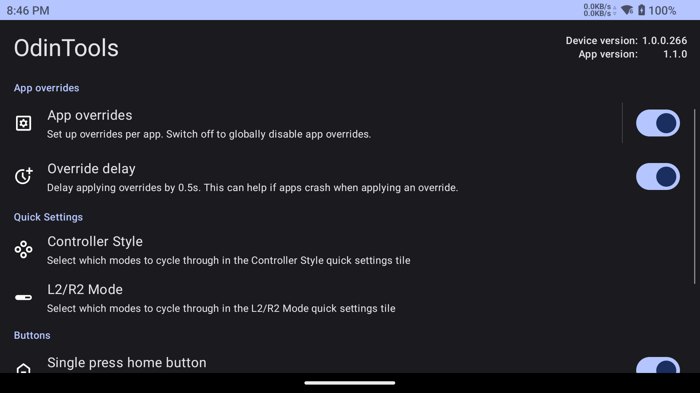
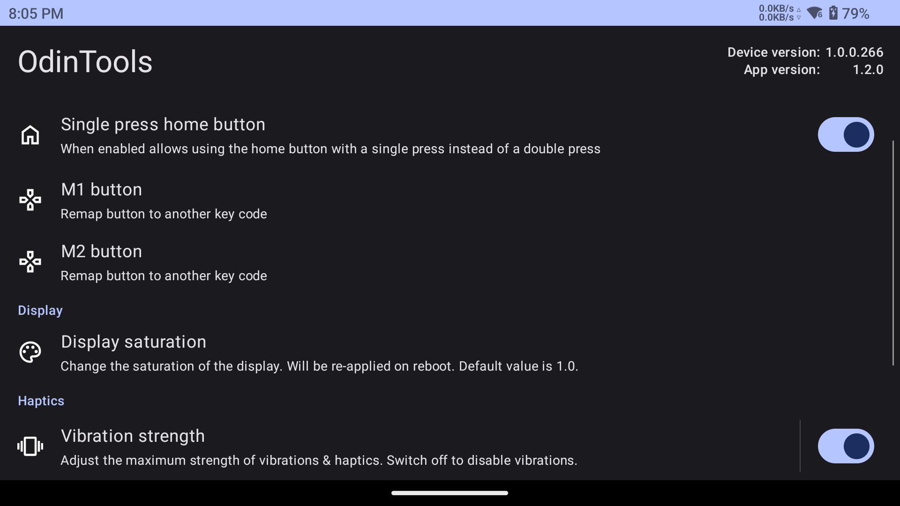
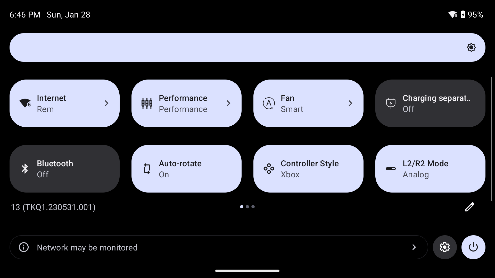
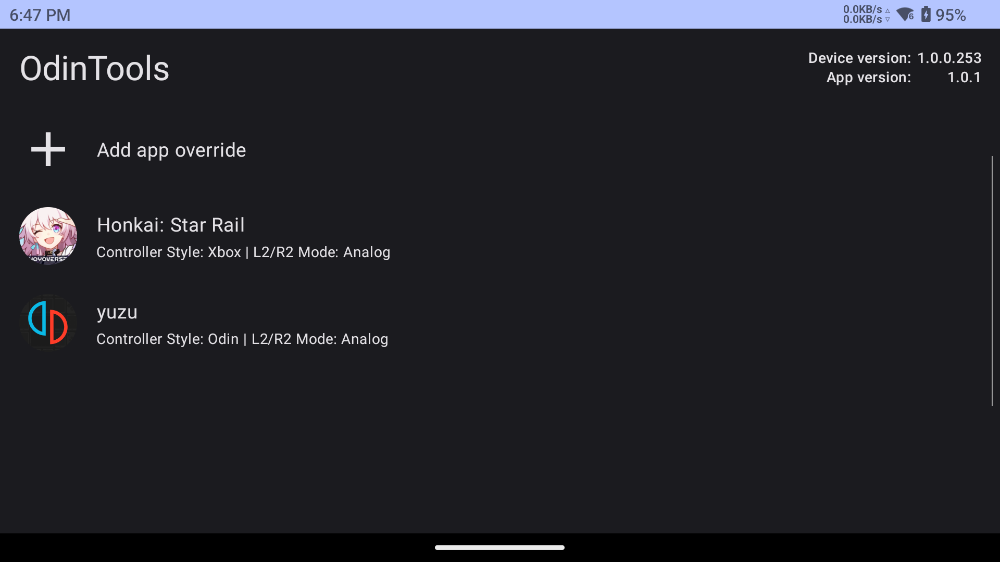

# OdinTools
Collection of utilities for the AYN Odin 2.  

Latest release: **[1.3.1](https://github.com/langerhans/OdinTools/releases/latest)**

### Features
#### App overrides
- Per-app overrides for both controller style and L2/R2 style settings. These will be applied and reverted automatically based on the current foreground app.
- Per-app overrides for performance and fan modes. They function just like controller style overrides.
- Override controller style and L2/R2 style when an external display is connected.
#### Quick settings
- Quick settings tile for switching the controller style with user selectable option for which styles to cycle through.
- Quick settings tile for switching the L2/R2 style with user selectable option for which styles to cycle through.
#### Button utilities
- Single press home button setting to allow going to the home screen by a single press of the home button.
- M1 and M2 buttons can be remapped to other face buttons.
#### Others
- Display saturation setting. This is set immediately and will be applied after a reboot as well. Note that it takes a few seconds after you first unlock the device to apply.
- Vibration strength setting which allows more fine-grained control over the vibration strength and even lower values than the lowest stock setting.
- Automatically enable and disable charging separation at customizable battery levels.

### Contact
If you have any questions, feel free to find me on the AYN Discord at https://discord.com/invite/pWCpvEUTdR

### Compatibility

This app has been tested with the Odin 2 firmware version **1.0.0.288**. It's possible that AYN breaks the methods used
by this app in a future update. The app will warn you accordingly if that's the case.

### Screenshots
#### Main menu

#### QS tiles

#### App overrides

